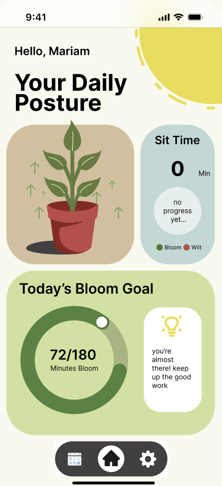
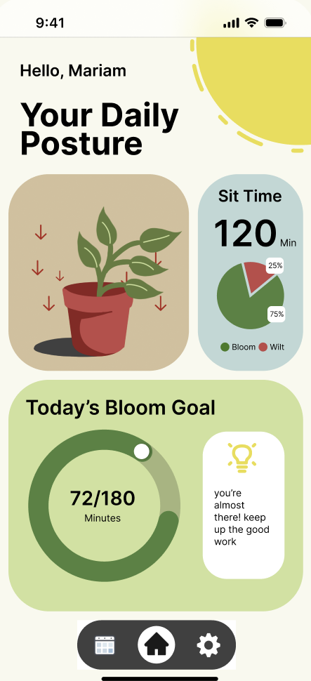
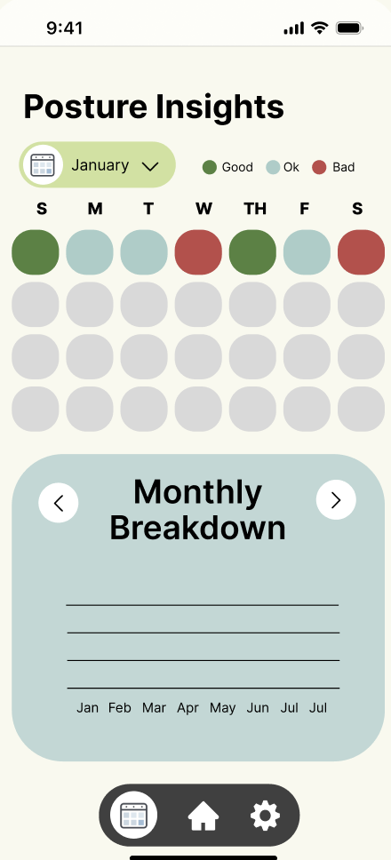
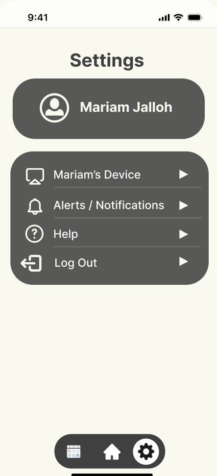

# Posture App

## Description

The Posture App is designed to help users monitor and improve their posture through interactive features and visual feedback. By tracking daily posture habits, the app provides insights and reminders to maintain good posture, ultimately promoting better health and well-being.

### Key Features

- **Posture Tracking**: Monitor your posture throughout the day and receive feedback on your posture habits.
- **Interactive Calendar**: View your posture data on a monthly calendar to identify trends and patterns.
- **Notifications**: Receive reminders and alerts to correct your posture when it deviates from the ideal.
- **Progress Visualization**: Visualize your posture improvement over time with detailed graphs and charts.
- **Calibration**: Calibrate the app to your specific posture needs to ensure accurate tracking and feedback.
- **User-Friendly Interface**: Enjoy a clean and intuitive interface that makes it easy to navigate and use the app.

### Benefits

- **Improved Posture**: Regular reminders and feedback help you maintain good posture, reducing the risk of back pain and other related issues.
- **Increased Awareness**: Gain insights into your posture habits and make informed decisions to improve your overall health.
- **Motivation**: Track your progress and stay motivated to maintain good posture with visual feedback and progress reports.

### Screenshots

  
  
  
  

